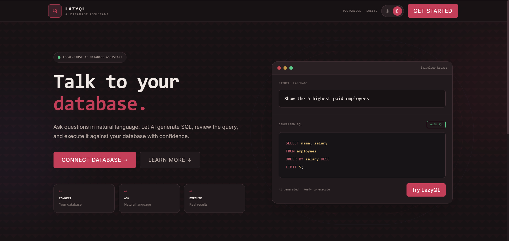
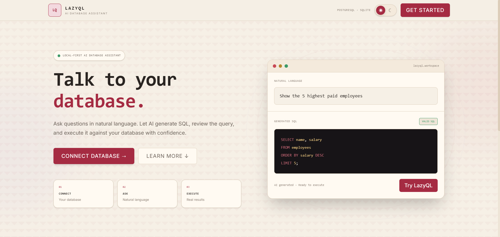
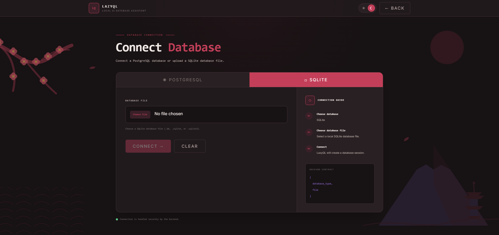
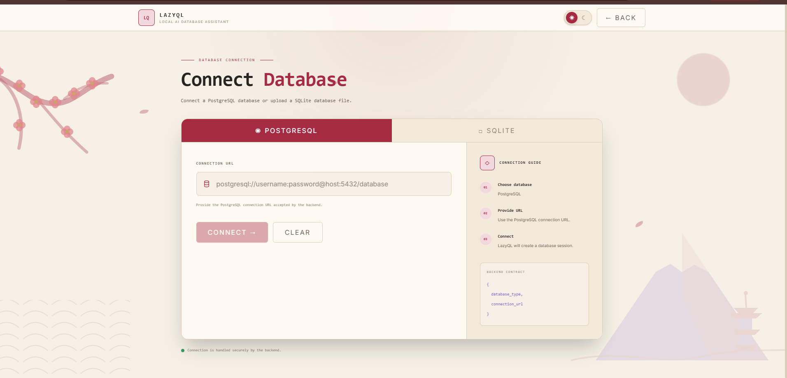
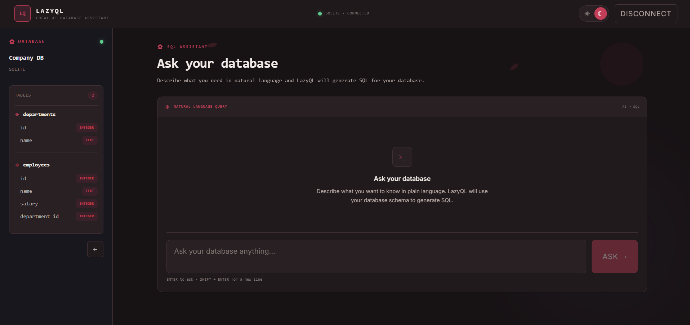
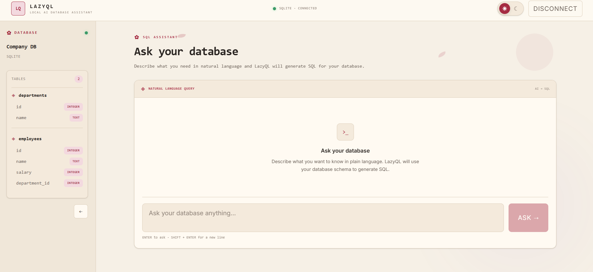
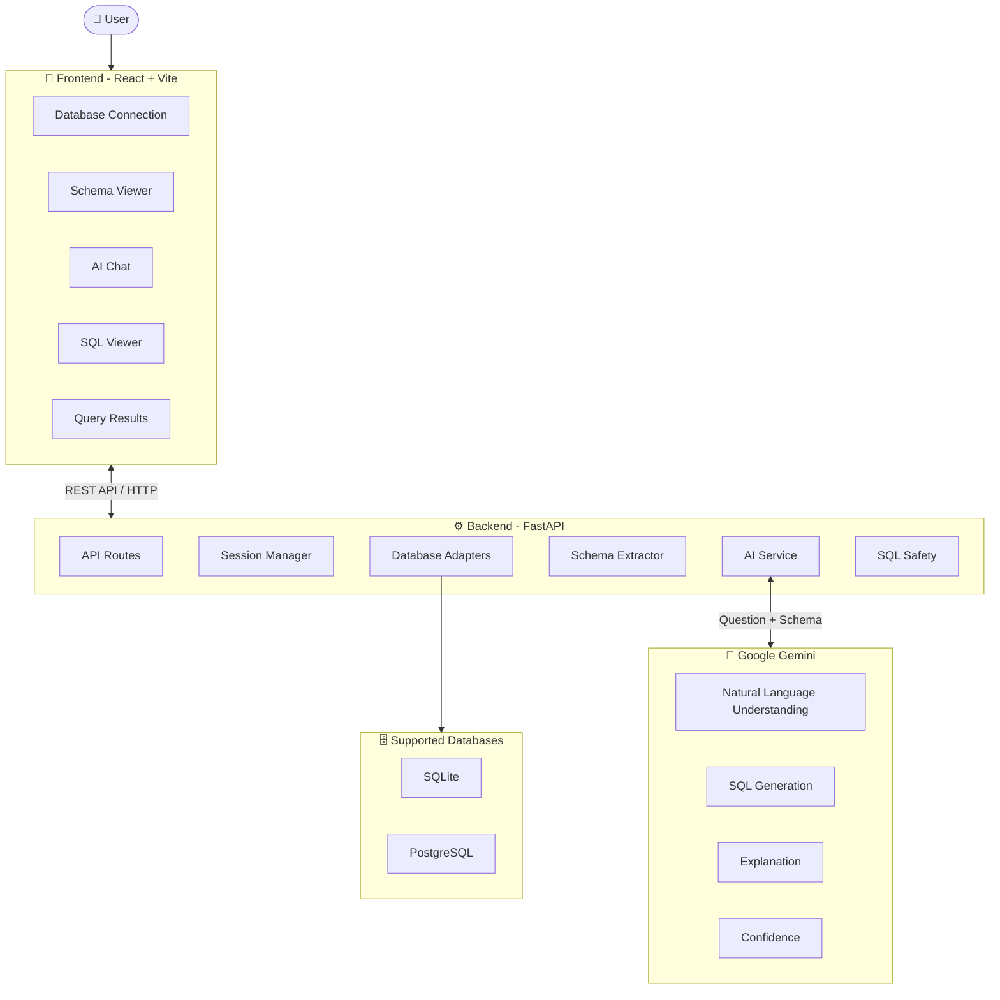

<div align="center">

# ⚡ LazyQL

### Ask Your Database Questions in Plain English

LazyQL is an AI-powered database assistant that converts natural-language questions into SQL queries using the actual schema of a connected database.

It supports **SQLite and PostgreSQL**, allowing users to connect a database, automatically inspect its schema, ask questions in natural language, generate SQL using Gemini, review the query, and execute it to retrieve results.

<p>


</p>

</div>

---

# 🔗 Live Demo

🌐 **Frontend:** `YOUR_FRONTEND_URL`

🔧 **Backend API:** https://lazyql.onrender.com

📚 **API Documentation:** https://lazyql.onrender.com/docs

---

# 🎥 Product Tour

<table width="100%">
<tr>

<td width="50%" align="center">

<h3>🌞 Light Mode</h3>


</td>

<td width="50%" align="center">

<h3>🌙 Dark Mode</h3>


</td>

</tr>
</table>

---

# 📖 Why LazyQL?

SQL is powerful, but users need to understand database schemas, table relationships, column names, and SQL syntax before they can query a database effectively.

For simple questions, users often have to:

1. Open a database client.
2. Inspect the schema.
3. Figure out the correct tables and columns.
4. Write the SQL query.
5. Execute and inspect the results.

LazyQL provides a natural-language interface on top of this workflow.

Instead of writing:

```sql
SELECT name, salary
FROM employees
ORDER BY salary DESC
LIMIT 5;
```

users can simply ask:

> **"Show me the 5 highest paid employees."**

LazyQL extracts the database schema and provides it to Gemini along with strict SQL-generation rules. Gemini then generates a SQL query based on the actual tables and columns available in the database.

---

# ✨ Features

## 🔌 Database Connectivity

- SQLite database upload
- PostgreSQL connection support
- SQLAlchemy-based database abstraction
- Database connection validation
- Database session management
- Connection error handling

### 🗂️ Schema Intelligence

- Automatic schema extraction
- Table discovery
- Column discovery
- Database-aware schema representation
- Schema passed directly to the AI generation layer
- Prevents the AI from inventing tables or columns

### 🤖 AI SQL Generation

- Natural-language → SQL
- Google Gemini integration
- Schema-aware prompting
- SQL explanation
- Confidence score
- Structured AI responses
- Provider-independent AI service abstraction

### 🛡️ SQL Safety

LazyQL currently follows a **read-only SQL model**.

The AI is instructed not to generate destructive operations such as:

```text
INSERT
UPDATE
DELETE
DROP
ALTER
CREATE
TRUNCATE
```

This provides an additional safety layer between natural-language requests and database execution.

### ▶️ Query Execution

- Execute generated SQL
- Execute queries against SQLite
- Execute queries against PostgreSQL
- Display returned columns
- Display returned rows
- Query execution error handling

### 💬 Interactive Query Experience

- Natural-language chat interface
- AI-generated SQL
- SQL explanation
- Confidence score
- Loading states
- Error handling
- Query result display

---

# 🔄 How LazyQL Works

```text
User
 │
 │ Natural-language question
 ▼
┌─────────────────────┐
│   LazyQL Frontend   │
│   React + Vite      │
└──────────┬──────────┘
           │
           │ REST API
           ▼
┌─────────────────────┐
│   FastAPI Backend   │
└──────────┬──────────┘
           │
           ▼
┌─────────────────────┐
│ Database Session    │
└──────────┬──────────┘
           │
           ▼
┌─────────────────────┐
│ Schema Extraction   │
└──────────┬──────────┘
           │
           │ Schema + Question
           ▼
┌─────────────────────┐
│     Gemini AI       │
└──────────┬──────────┘
           │
           │ Generated SQL
           ▼
┌─────────────────────┐
│    SQL Safety       │
└──────────┬──────────┘
           │
           ▼
┌─────────────────────┐
│ Database Execution  │
└──────────┬──────────┘
           │
           ▼
        Results
```

---

# 🧠 AI Architecture

LazyQL separates the AI layer from the API layer using an `AIService` abstraction.

```text
                 AIService
                     │
          ┌──────────┴──────────┐
          ▼                     ▼
   GeminiService          MockAIService
          │                     │
          ▼                     ▼
     Gemini API            Automated Tests
```

The AI service receives:

```text
User Question
+
Database Schema
+
SQL Generation Rules
```

and returns:

```json
{
  "sql": "SELECT ...;",
  "explanation": "Short explanation.",
  "confidence": 0.95
}
```

This separation makes the AI provider replaceable without coupling the API layer directly to a specific provider.

---

# 🛡️ Read-Only SQL Safety

LazyQL currently focuses on **safe, read-only database interaction**.

The AI generation layer explicitly restricts queries to read operations.

For example:

### Allowed

```sql
SELECT name, salary
FROM employees
ORDER BY salary DESC;
```

### Blocked

```sql
DELETE FROM employees;
```

```sql
DROP TABLE employees;
```

```sql
UPDATE employees
SET salary = 0;
```

The current MVP intentionally keeps database interaction read-only.

> Controlled write operations with explicit confirmation and role-based permissions are planned for future versions.

---

# 🖼️ Application Preview

## 🏠 Home

| Dark Mode | Light Mode |
|-----------|------------|
|  |  |

---

## 🔌 Database Connection

| Dark Mode | Light Mode |
|-----------|------------|
|  |  |

---

## 🤖 AI SQL Generation

| Dark Mode | Light Mode |
|-----------|------------|
|  |  |

---

# 🏗️ System Architecture



---

# 🔌 Database Adapter Architecture

LazyQL uses a common database adapter interface so different database engines can be supported without changing the API layer.

```text
             DatabaseAdapter
                    │
          ┌─────────┴─────────┐
          ▼                   ▼
   SQLiteAdapter       PostgreSQLAdapter
          │                   │
          ▼                   ▼
       SQLite            PostgreSQL
```

Each adapter handles:

- Connection
- Schema extraction
- Query execution
- Closing the connection

This makes the database layer extensible for future database engines.

---

# 📡 API

## Create Database Session

```http
POST /database/session
```

Supports:

- SQLite file upload
- PostgreSQL connection URL

---

## Get Database Schema

```http
POST /database/schema?session_id=<session_id>
```

Returns the schema of the connected database.

---

## Generate SQL

```http
POST /generate
```

Example request:

```json
{
  "session_id": "session-id",
  "question": "Show the highest paid employees"
}
```

Example response:

```json
{
  "sql": "SELECT name, salary FROM employees ORDER BY salary DESC;",
  "explanation": "Retrieves employees ordered by salary from highest to lowest.",
  "confidence": 0.95
}
```

---

## Execute Query

```http
POST /database/execute
```

Example request:

```json
{
  "session_id": "session-id",
  "sql": "SELECT name, salary FROM employees;"
}
```

Example response:

```json
{
  "success": true,
  "columns": ["name", "salary"],
  "rows": [
    ["Aditya", 1200000],
    ["Rahul", 1000000]
  ]
}
```

---

# ⚡ Tech Stack

## 🎨 Frontend

- React
- Vite
- Tailwind CSS
- React Hooks
- REST API integration

## ⚙️ Backend

- Python
- FastAPI
- SQLAlchemy
- Pydantic
- Uvicorn

## 🗄️ Database

- SQLite
- PostgreSQL
- Psycopg 3

## 🤖 AI

- Google Gemini
- `google-genai`

## 🧪 Testing

- Pytest
- FastAPI TestClient
- HTTPX
- API tests
- Database adapter tests
- Schema extraction tests
- Session management tests

## 🛠️ Developer Tools

- Git
- GitHub
- Postman
- VS Code

---

# 📂 Project Structure

```text
LazyQL
│
├── assets
│   ├── ai-dark.png
│   ├── ai-light.png
│   ├── data-dark.png
│   ├── data-light.png
│   ├── home-dark.png
│   ├── home-light.png
│   ├── learning-workflow-demo-darkmode.gif
│   └── learning-workflow-demo-lightmode.gif
│
├── database
│   └── samples
│       └── company.db
│
├── frontend
│   └── lazyfql
│       ├── public
│       ├── src
│       │   ├── api
│       │   ├── assets
│       │   ├── components
│       │   │   ├── chat
│       │   │   ├── common
│       │   │   ├── connection
│       │   │   ├── context
│       │   │   ├── hooks
│       │   │   ├── modals
│       │   │   ├── results
│       │   │   ├── schema
│       │   │   └── sql
│       │   ├── data
│       │   ├── ConnectionPage.jsx
│       │   ├── HomePage.jsx
│       │   ├── Workspace.jsx
│       │   ├── App.css
│       │   ├── App.jsx
│       │   ├── index.css
│       │   └── main.jsx
│       ├── .env.example
│       ├── .gitignore
│       ├── README.md
│       ├── eslint.config.js
│       ├── index.html
│       ├── package-lock.json
│       ├── package.json
│       └── vite.config.js
│
├── scripts
│   └── init_demo_db.py
│
├── server
│   ├── app
│   │   ├── ai
│   │   │   ├── gemini.py
│   │   │   ├── mock.py
│   │   │   └── service.py
│   │   ├── api
│   │   │   └── routes
│   │   ├── database
│   │   │   ├── base.py
│   │   │   ├── connection.py
│   │   │   ├── sqlite.py
│   │   │   ├── postgres.py
│   │   │   ├── schema.py
│   │   │   └── session_manager.py
│   │   ├── models
│   │   └── main.py
│   ├── tests
│   │   ├── api
│   │   └── database
│   ├── .env.example
│   ├── requirements.txt
│   └── ...
│
├── .gitignore
├── README.md
└── LICENSE
```

# 🚀 Getting Started

Follow these steps to run LazyQL locally.

## 📋 Prerequisites

Make sure you have:

- Python 3.12+
- Node.js
- npm
- Git
- Gemini API key
- PostgreSQL database *(optional)*

---

# 📥 Clone the Repository

```bash
git clone https://github.com/dyson-025/LazyQL.git

cd LazyQL
```

---

# ⚙️ Backend Setup

```bash
cd server

python -m venv venv
```

### Windows

```powershell
.\venv\Scripts\Activate.ps1
```

### Install Dependencies

```bash
python -m pip install -r requirements.txt
```

---

# 🔑 Environment Variables

Create:

```text
server/.env
```

Add:

```env
GEMINI_API_KEY=your_gemini_api_key
GEMINI_MODEL=gemini-2.5-flash-lite
```

> Never commit `.env` or API keys to GitHub.

---

# ▶️ Run Backend

From the `server` directory:

```bash
uvicorn app.main:app --reload
```

The backend will run at:

```text
http://127.0.0.1:8000
```

---

# 🎨 Frontend Setup

Open another terminal:

```bash
cd frontend/lazyfql
npm install
npm run dev
```

Open the URL provided by Vite.

---

# 🧪 Running Tests

From the `server` directory:

```bash
python -m pytest
```

The test suite covers:

- API endpoints
- Database connections
- SQLite adapter
- PostgreSQL adapter
- Schema extraction
- Database sessions
- Query execution
- SQL generation

---

# 🛣️ Roadmap

LazyQL MVP currently focuses on **AI-powered natural-language database querying**.

Future versions may include:

- [ ] User authentication
- [ ] Admin dashboard
- [ ] Company/workspace management
- [ ] Invite links
- [ ] Role-based access control
- [ ] Database-level permissions
- [ ] Controlled `INSERT` / `UPDATE` / `DELETE`
- [ ] Explicit write-query confirmation
- [ ] Query history
- [ ] Audit logs
- [ ] AI SQL error correction
- [ ] Secure credential management
- [ ] Additional database engines
- [ ] Production-ready enterprise deployment

---

# 🤝 Contributing

Contributions are welcome!

If you'd like to improve LazyQL:

1. Fork the repository
2. Create a feature branch
3. Make your changes
4. Run the test suite
5. Commit your changes
6. Push your branch
7. Open a Pull Request

Please ensure existing tests continue to pass.

---

# 📄 License

This project is licensed under the MIT License.

See the [LICENSE](LICENSE) file for more information.

---

# ⭐ Support

If you found LazyQL useful, consider giving the repository a ⭐ on GitHub.

It helps others discover the project and motivates future development.
